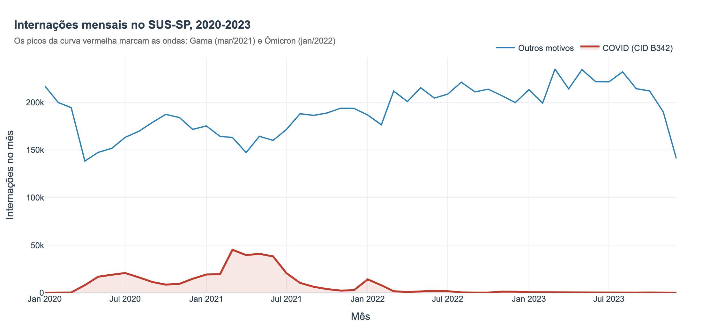
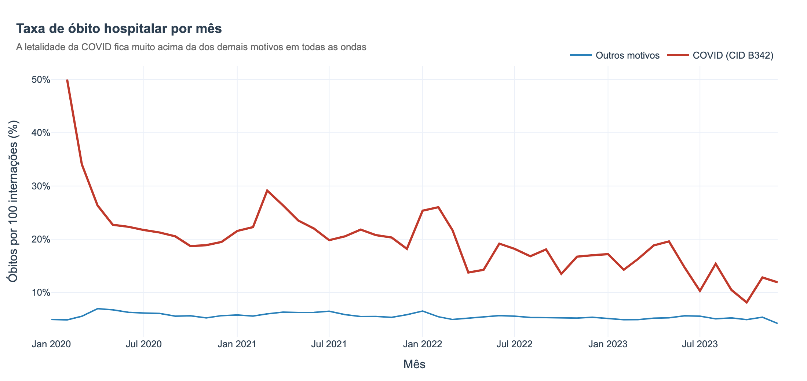
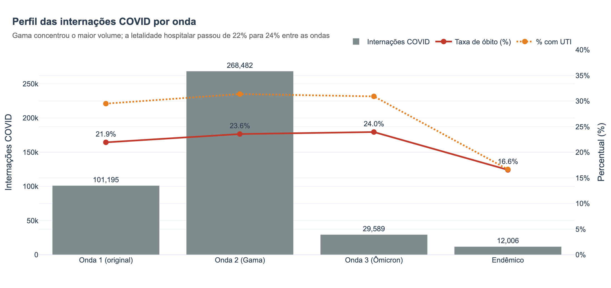
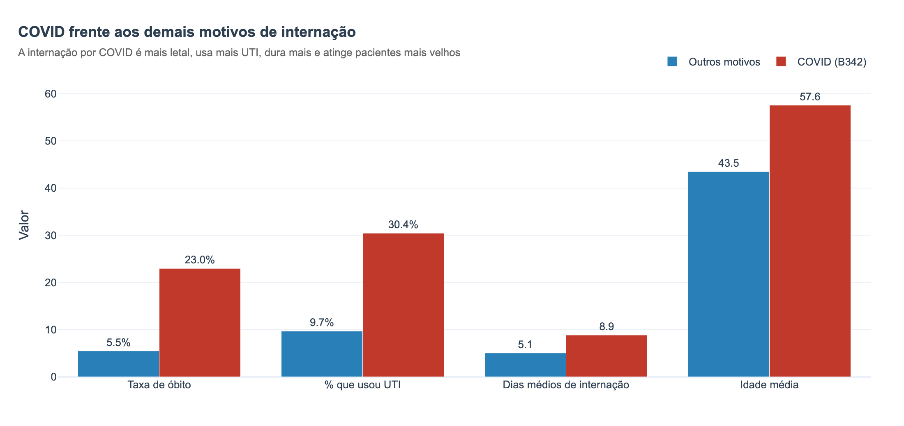
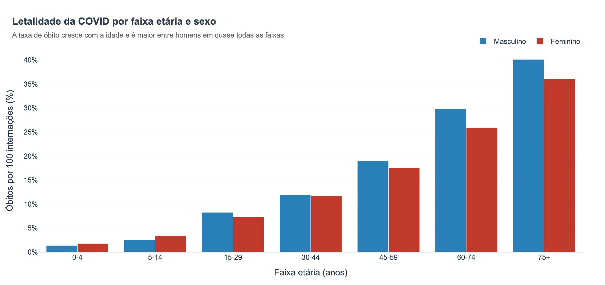
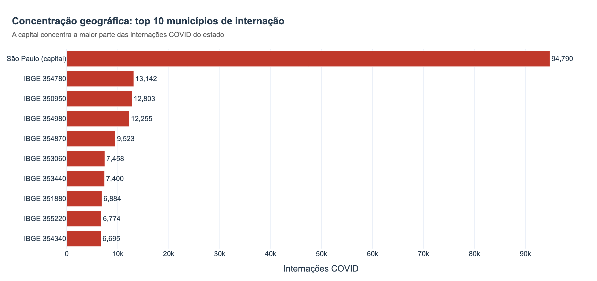

# SUS Analytics: Impacto da COVID-19 nas internações hospitalares (SP, 2020-2023)

> Projeto final da disciplina **Fundamentos de Big Data**.
> Pipeline de Big Data completo sobre dados públicos do SIH/SUS (DATASUS),
> da ingestão dos dados brutos até um dashboard interativo de resultados.

**Equipe:** Bruno Ribeiro · Cláudio Alves · Vinícius Ventura

Este `README` é estruturado como o relatório do projeto, seguindo a organização de um
relatório técnico (introdução, motivação, objetivo, metodologia, resultados e conclusões).

---

## Sumário

1. [Introdução](#1-introdução)
2. [Motivação](#2-motivação)
3. [Objetivo do projeto](#3-objetivo-do-projeto)
4. [Metodologia: o pipeline de dados](#4-metodologia-o-pipeline-de-dados)
5. [Resultados e visualizações](#5-resultados-e-visualizações)
6. [Conclusões](#6-conclusões)
7. [Estrutura do repositório](#7-estrutura-do-repositório)
8. [Como reproduzir](#8-como-reproduzir)
9. [Tecnologias](#9-tecnologias)

---

## 1. Introdução

A pandemia de COVID-19 pressionou de forma sem precedentes o sistema hospitalar
brasileiro. São Paulo, estado mais populoso e com a maior rede do SUS, concentrou os
maiores picos de internação do país. O Sistema de Informações Hospitalares do SUS
(SIH/SUS), publicado pelo DATASUS, registra cada Autorização de Internação Hospitalar
(AIH) e oferece um retrato administrativo detalhado desse impacto.

Este projeto constrói um **pipeline de Big Data** sobre o SIH/SUS restrito a São Paulo,
de 2020 a 2023, organizando quase **10 milhões de internações** desde o dado bruto até
insights consolidados.

**Pergunta de pesquisa:**

> Como as ondas da COVID-19 impactaram o volume de internações e a mortalidade
> hospitalar no SUS-SP entre 2020 e 2023?

**Sub-perguntas:**

- Como evoluiu, mês a mês, o volume de internações por COVID (CID B342)?
- A taxa de óbito hospitalar subiu durante os picos da pandemia?
- O perfil da internação (dias de permanência e uso de UTI) mudou de uma onda para outra?
- Quais grupos demográficos (sexo e faixa etária) foram mais afetados?

## 2. Motivação

Entender o comportamento das internações por COVID em uma base real tem valor prático:
ajuda a dimensionar a pressão sobre leitos e UTIs, a identificar os grupos mais
vulneráveis e a avaliar como a gravidade mudou ao longo das ondas. O SIH/SUS é uma fonte
pública, volumosa e padronizada, ideal para exercitar um pipeline de Big Data ponta a
ponta, com os desafios reais de ingestão de formato proprietário (`.dbc`), limpeza,
tipagem e agregação de milhões de registros.

O recorte de **São Paulo** foi escolhido porque concentra a maior rede hospitalar do SUS
e os maiores picos de internação por COVID, oferecendo volume e coesão geográfica sem
inflar o pipeline com dados que não responderiam à pergunta.

## 3. Objetivo do projeto

Desenvolver uma solução baseada em dados que **responda à pergunta de pesquisa**,
implementando e documentando todas as etapas de um pipeline de Big Data, fontes,
ingestão, armazenamento, transformação, carregamento e destino, e entregando os
resultados em visualizações e em um **dashboard interativo**.

## 4. Metodologia: o pipeline de dados

A solução segue a **arquitetura medalhão** (bronze, silver e gold), cada camada com um
papel claro. O diagrama abaixo resume o fluxo:

```text
[Fonte: SIH/SUS (DATASUS), FTP público]
        |
        v  Ingestão  (src/ingest_bronze.py)
[BRONZE]  data/bronze/sihsus/SP/*.dbc  -> sihsus_sp_raw.parquet
        |  48 arquivos .dbc, 113 campos, ~9,85 M linhas (dado bruto, intocado)
        |
        v  Transformação  (src/transform_silver.py)
[SILVER]  data/silver/sihsus_sp.parquet
        |  17 campos + 9 derivados = 26 colunas, ~9,60 M linhas
        |  limpeza, tipagem, filtro de período, enriquecimento e normalização
        |
        v  Carregamento/Agregação  (src/build_gold.py)
[GOLD]    data/gold/*.parquet e *.csv
        |  5 tabelas agregadas, prontas para análise
        |
        v  Destino  (src/build_dashboard.py + notebooks)
[CONSUMO] output/dashboard.html (interativo) · notebooks de análise
```

### 4.1 Fontes de dados

| Fonte | Descrição | Formato | Cobertura |
| ----- | --------- | ------- | --------- |
| SIH/SUS (DATASUS) | Autorizações de Internação Hospitalar, AIH Reduzida | `.dbc` | SP, Jan/2020 a Dez/2023 |

O SIH/SUS é um dado **estruturado**, distribuído em arquivos `.dbc` (um DBF comprimido,
formato proprietário do DATASUS), um por mês de competência.

### 4.2 Ingestão (camada bronze): `src/ingest_bronze.py`

Lê os 48 arquivos `.dbc`, descomprime cada um (`datasus-dbc` + `dbfread`) e consolida
tudo em um único Parquet bruto, **preservando os 113 campos originais**. Nenhuma seleção,
tipagem ou filtro acontece aqui: a bronze é a fonte da verdade imutável.

### 4.3 Armazenamento

Todas as camadas são persistidas em **Parquet** (colunar e comprimido, via `pyarrow`),
formato adequado para consultas analíticas sobre milhões de linhas. A camada gold também
é exportada em **CSV**, por ser pequena e fácil de inspecionar.

### 4.4 Transformação (camada silver): `src/transform_silver.py`

Aplica, em ordem: **seleção** de 17 campos relevantes (de 113); **tipagem** (datas →
`datetime`, numéricos → `Int64`/`float`, strings normalizadas); **remoção de nulos** e
**de duplicatas**; **filtro de período** (2020-2023); **enriquecimento linha a linha**
(`is_covid`, `ano`, `mes`, `ano_mes`, `faixa_etaria`); e **normalização Min-Max** das
variáveis numéricas. Ao final, uma rotina de **auditoria** roda asserções de invariante
(sem nulos, sem duplicatas, período válido, normalização em `[0, 1]`), se alguma falha,
o pipeline para e nada é gravado.

### 4.5 Carregamento e agregação (camada gold): `src/build_gold.py`

Materializa **cinco tabelas agregadas**, cada uma voltada a uma parte da pergunta:

| Tabela gold | Conteúdo |
| ----------- | -------- |
| `serie_mensal` | Internações e óbitos por mês (COVID vs outros) |
| `ondas` | Consolidado por onda da pandemia (volume, letalidade, UTI, permanência) |
| `perfil_covid_vs_outros` | Perfil clínico COVID frente aos demais motivos |
| `demografia_covid` | Internações e óbitos COVID por sexo e faixa etária |
| `municipios_covid` | Top municípios por internação COVID |

As **janelas das ondas** não são arbitrárias: foram definidas a partir dos picos da
própria série mensal de internações por COVID (Onda 1/original, Onda 2/Gama,
Onda 3/Ômicron e período endêmico).

### 4.6 Destino e consumo: `src/build_dashboard.py` e notebooks

O destino final são as **visualizações**: um dashboard HTML interativo
(`output/dashboard.html`, com Plotly embutido, abre offline, sem servidor) e os
notebooks de análise. As figuras estáticas em `output/figuras/` são geradas a partir das
mesmas funções do dashboard, garantindo uma única fonte de verdade visual.

> **Evidências do pipeline (resposta ao feedback da AV1).** Na AV1, foi apontado que
> faltavam saídas visuais nas camadas anteriores à gold. Para endereçar isso, o notebook
> [`notebooks/00_pipeline_evidencias.ipynb`](notebooks/00_pipeline_evidencias.ipynb)
> mostra, com gráficos, como os dados chegaram (volume de ingestão por mês), o que foi
> transformado (funil de limpeza da bronze para a silver) e quais tabelas foram geradas
> (camada gold).

## 5. Resultados e visualizações

Todos os números e gráficos abaixo são derivados da camada gold. A versão **interativa**
está em [`output/dashboard.html`](output/dashboard.html); a análise completa, com leitura
crítica de cada gráfico, está em
[`notebooks/03_gold_analise.ipynb`](notebooks/03_gold_analise.ipynb).

### Números-chave

| Métrica | Valor |
| ------- | ----- |
| Internações totais (SP, 2020-2023) | ~9,60 milhões |
| Internações por COVID (CID B342) | **411.272** |
| Óbitos por COVID | **94.571** |
| Letalidade hospitalar (COVID) | **23,0%** |
| Letalidade hospitalar (outros motivos) | **5,5%** |
| Mês de pico (variante Gama) | **março de 2021** (45.180 internações) |

### 5.1 Evolução mensal das internações



O volume de internações por COVID se concentra em **três ondas**. A maior foi a da
variante **Gama**, com pico de **45.180 internações em março de 2021**. As internações
por outros motivos caem no primeiro pico de 2020, sinal do represamento de procedimentos
eletivos na fase mais aguda.

### 5.2 Mortalidade hospitalar



A letalidade hospitalar da COVID fica **muito acima** da dos demais motivos em quase todos
os meses, **23,0% contra 5,5%** no período, cerca de **4,2×**, e a distância se abre nos
picos das ondas.

### 5.3 Perfil das internações por onda



A **Onda 2 (Gama)** concentrou o maior volume (**268.482 internações**). A letalidade
hospitalar subiu de forma contínua entre as ondas (**21,9% → 23,6% → 24,0%**), com uso de
UTI perto de **30%**. No **período endêmico**, letalidade (16,6%) e uso de UTI (16,7%)
caem pela metade.

### 5.4 COVID frente aos demais motivos



A internação por COVID é, em todas as dimensões, mais grave: mais letal, usa **mais que o
triplo de UTI** (30,4% vs 9,7%), dura mais (8,9 vs 5,1 dias) e atinge pacientes mais
velhos (57,6 vs 43,5 anos em média).

### 5.5 Quem foi mais afetado



A letalidade **cresce acentuadamente com a idade**. O grupo mais atingido é o de
**homens com 75 anos ou mais (40,1% de óbito)**. Em quase todas as faixas, a taxa
masculina supera a feminina.

### 5.6 Concentração geográfica



As internações se concentram fortemente na **capital (São Paulo, IBGE 355030)**, coerente
com a concentração da rede de alta complexidade do SUS.

## 6. Conclusões

- O impacto da COVID nas internações do SUS-SP foi **concentrado em ondas**, com pico
  absoluto em **março de 2021** (variante Gama).
- A doença foi **muito mais letal** no hospital que a média das demais internações
  (**23,0% vs 5,5%**) e exigiu **três vezes mais UTI**.
- A **gravidade aumentou da Onda 1 à Ômicron** e só recuou no **período endêmico**, quando
  letalidade e uso de UTI caíram pela metade, efeito coerente com vacinação e mudança no
  perfil dos casos.
- O desfecho foi fortemente **etário e por sexo**: idosos, em especial **homens com 75+**,
  tiveram a maior letalidade.
- O peso recaiu sobre a **capital**, que concentra a rede de alta complexidade.

**Limitações.** A base é administrativa (AIH) e cobre apenas internações pagas pelo SUS;
não inclui rede privada nem casos não internados. O CID B342 é o registro do SIH/SUS para
COVID e pode subnotificar casos codificados de outra forma. As janelas de onda são uma
convenção analítica baseada nos picos da própria série.

**Trabalhos futuros.** Estender o recorte a outros estados; cruzar com dados de
vacinação e de população (taxas por 100 mil habitantes); e modelar a previsão de demanda
por leitos.

## 7. Estrutura do repositório

```text
data/
  bronze/
    sihsus/SP/             # 48 arquivos .dbc (Jan/2020 a Dez/2023)
    sihsus_sp_raw.parquet  # Parquet bruto consolidado (não versionado, regenerável)
  silver/
    sihsus_sp.parquet      # Silver limpa e tipada (não versionada, regenerável)
  gold/                    # 5 tabelas agregadas (CSV + Parquet, versionadas)
src/
  ingest_bronze.py         # Ingestão: .dbc -> Parquet bruto (bronze)
  transform_silver.py      # Transformação: bronze -> silver
  build_gold.py            # Agregação: silver -> gold
  build_dashboard.py       # Destino: gold -> dashboard.html + figuras PNG
  pipeline_stats.py        # Estatísticas de evidência do pipeline (bronze/silver)
notebooks/
  00_pipeline_evidencias.ipynb  # Evidências visuais de bronze e silver
  01_exploracao_sihsus.ipynb    # Demonstração técnica do pipeline (AV1)
  02_silver_visualizacoes.ipynb # Visualizações exploratórias da silver (AV1)
  03_gold_analise.ipynb         # Análise da gold e geração do dashboard (AV2)
output/
  dashboard.html           # Dashboard interativo (entrega principal de resultados)
  figuras/                 # PNGs das visualizações (usados neste relatório)
docs/
  arquitetura_dados.md     # Arquitetura detalhada do pipeline
  checklist_av2.md         # Checklist de status da AV2
  team_roles.md            # Divisão de tarefas da equipe
requirements.txt
```

## 8. Como reproduzir

```bash
# 1. Instalar as dependências
pip install -r requirements.txt

# 2. Ingestão: .dbc -> bronze (requer os .dbc em data/bronze/sihsus/SP/)
python src/ingest_bronze.py

# 3. Transformação: bronze -> silver
python src/transform_silver.py

# 4. Agregação: silver -> gold
python src/build_gold.py

# 5. Dashboard e figuras: gold -> output/
python src/build_dashboard.py

# 6. (Opcional) Estatísticas de evidência do pipeline
python src/pipeline_stats.py

# 7. Notebooks de análise
jupyter notebook notebooks/03_gold_analise.ipynb
```

> Os scripts assumem execução a partir da pasta `src/` (caminhos relativos `../data`).
> O dashboard interativo final fica em `output/dashboard.html` e abre em qualquer
> navegador, sem servidor.

## 9. Tecnologias

| Etapa | Tecnologia | Por que |
| ----- | ---------- | ------- |
| Ingestão `.dbc` | `datasus-dbc`, `dbfread` | Leem o formato proprietário do DATASUS sem conversão externa |
| Processamento | `pandas`, `numpy` | Atendem o volume com folga e o time domina |
| Armazenamento | Parquet via `pyarrow` | Colunar e comprimido, ótimo para consultas analíticas |
| Agregação | `pandas` | Tabelas gold pequenas e prontas para consumo |
| Visualização estática | `matplotlib`, `seaborn` | Gráficos de evidência do pipeline |
| Visualização interativa | `plotly`, `kaleido` | Dashboard interativo e export de PNG |
| Notebooks | Jupyter | Análise reproduzível e demonstração |
| Versionamento | Git e GitHub | Histórico e colaboração |

Tecnologias pagas que entrariam em uma versão profissional (AWS S3, Apache Spark, dbt,
Airflow, Databricks) estão discutidas em [`docs/arquitetura_dados.md`](docs/arquitetura_dados.md).

---

## Licença

Dados públicos do DATASUS, Ministério da Saúde. Código sob licença de uso acadêmico.
